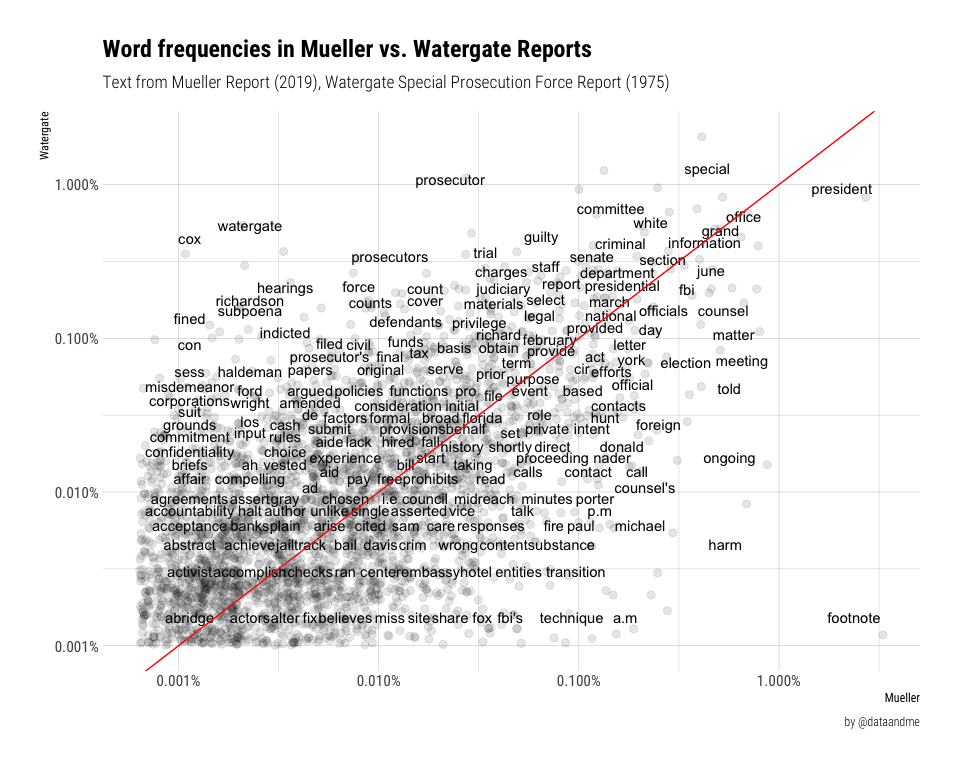

Tidy Mueller: Factbase edition
================

Using data from Factbase’s *The Mueller Report: 18 April, 2019*
<https://f2.link/mr-sheet>. Big ups to Garrick Aden-Buie’s extraction of
the report available here: [The Redacted, Text-Extracted Mueller
Report](https://www.garrickadenbuie.com/blog/redacted-text-extracted-mueller-report/).

``` r
library(tidyverse)
```

    ## ── Attaching packages ──────────────────────────────────────────────── tidyverse 1.2.1 ──

    ## ✔ ggplot2 3.1.1.9000     ✔ purrr   0.3.2     
    ## ✔ tibble  2.1.1          ✔ dplyr   0.8.0.9014
    ## ✔ tidyr   0.8.3          ✔ stringr 1.4.0     
    ## ✔ readr   1.3.1.9000     ✔ forcats 0.4.0

    ## ── Conflicts ─────────────────────────────────────────────────── tidyverse_conflicts() ──
    ## ✖ dplyr::filter() masks stats::filter()
    ## ✖ dplyr::lag()    masks stats::lag()

``` r
library(ggpage)
library(tidytext)
library(stringr)
```

``` r
mueller_report <- read_csv(here::here("data", "factbase_mueller_report.csv")) %>%
  select(Page, Text) %>%
  rename_all(tolower)
```

    ## Warning: Missing column names filled in: 'X4' [4]

    ## Parsed with column specification:
    ## cols(
    ##   Page = col_double(),
    ##   Text = col_character(),
    ##   `Definition (Appendix)` = col_logical(),
    ##   X4 = col_logical()
    ## )

    ## Warning: 235 parsing failures.
    ##  row                   col           expected                                                                                                                                                                                            actual                                                              file
    ## 3290 Definition (Appendix) 1/0/T/F/TRUE/FALSE Performer, executive vice president of Crocus Group, and son of Aras Agalarov; helped arrange the June 9, 2016 meeting at Trump Tower between Natalia Veselnitskaya and Trump Campaign officials. '/Users/maraaverick/tidymueller/data/factbase_mueller_report.csv'
    ## 3291 Definition (Appendix) 1/0/T/F/TRUE/FALSE Former member in the Ukrainian parliament who hired Paul Manafort to conduct work for Ukrainian political party, the Party of Regions.                                                            '/Users/maraaverick/tidymueller/data/factbase_mueller_report.csv'
    ## 3292 Definition (Appendix) 1/0/T/F/TRUE/FALSE U.S. lobbyist and associate of Natalia Veselnitskaya who attended the June 9, 2016 meeting at Trump Tower between Veselnitskaya and Trump Campaign officials.                                     '/Users/maraaverick/tidymueller/data/factbase_mueller_report.csv'
    ## 3293 Definition (Appendix) 1/0/T/F/TRUE/FALSE Head of U.S. department of the Internet Research Agency, which engaged in an "active measures" social media campaign to interfere in the 2016 U.S. presidential election.                         '/Users/maraaverick/tidymueller/data/factbase_mueller_report.csv'
    ## 3294 Definition (Appendix) 1/0/T/F/TRUE/FALSE Founder of WikiLeaks, which in 2016 posted on the internet documents stolen from entities and individuals affiliated with the Democratic Party.                                                   '/Users/maraaverick/tidymueller/data/factbase_mueller_report.csv'
    ## .... ..................... .................. ................................................................................................................................................................................................. .................................................................
    ## See problems(...) for more details.

``` r
# tidy texting ------------------------------------------------------------
tidy_mueller <- mueller_report %>%
  unnest_tokens(word, text)

# remove stop words
data(stop_words)

tidy_mueller <- tidy_mueller %>%
  anti_join(stop_words)
```

    ## Joining, by = "word"

``` r
mueller_word_count <- tidy_mueller %>%
  count(word, sort = TRUE) %>%
  filter(!str_detect(word, "[0-9]")) # remove numbers
```

[Watergate Special Prosecution Force
Report](https://archive.org/stream/WatergateSpecialProsuectionForceReport/Watergate%20Special%20Prosuection%20Force%20Report_djvu.txt%22)
via Internet Archive.

``` r
# read in watergate special prosecution force report ----------------------
# source: https://archive.org/stream/WatergateSpecialProsuectionForceReport/Watergate%20Special%20Prosuection%20Force%20Report_djvu.txt"
watergate_report <- read_csv(here::here("data", "watergate_report.csv"))
```

    ## Parsed with column specification:
    ## cols(
    ##   line = col_double(),
    ##   text = col_character()
    ## )

``` r
tidy_watergate <- watergate_report %>%
  unnest_tokens(word, text)

tidy_watergate <- tidy_watergate %>%
  anti_join(stop_words)
```

    ## Joining, by = "word"

``` r
watergate_word_count <- tidy_watergate %>%
  count(word, sort = TRUE) %>%
  filter(!str_detect(word, "[0-9]"))
```

``` r
# following: https://www.tidytextmining.com/tidytext.html#word-frequencies

# remove page bc we don't have it for watergate
tidy_mueller <- tidy_mueller %>%
  select(-page)

tidy_reports <- bind_rows(mutate(tidy_mueller, report = "Mueller"),
                    mutate(tidy_watergate, report = "Watergate")) %>%
  filter(!str_detect(word, "[0-9]"))

# following: https://www.tidytextmining.com/twitter.html#word-frequencies-1
raw_frequency <- tidy_reports %>%
  group_by(report) %>%
  count(word, sort = TRUE) %>%
  left_join(tidy_reports %>%
              group_by(report) %>%
              summarise(total = n())) %>%
  mutate(freq = n/total)
```

    ## Joining, by = "report"

``` r
frequency <- raw_frequency %>%
  select(report, word, freq) %>%
  spread(report, freq) %>%
  arrange(Mueller, Watergate) %>%
  filter(word != "sessions")


# plot relative frequencies -----------------------------------------------
library(scales)
```

    ## 
    ## Attaching package: 'scales'

    ## The following object is masked from 'package:purrr':
    ## 
    ##     discard

    ## The following object is masked from 'package:readr':
    ## 
    ##     col_factor

``` r
ggplot(frequency, aes(Mueller, Watergate)) +
  geom_jitter(alpha = 0.1, size = 2.5, width = 0.25, height = 0.25) +
  geom_text(aes(label = word), check_overlap = TRUE, vjust = 1.5) +
  scale_x_log10(labels = percent_format()) +
  scale_y_log10(labels = percent_format()) +
  geom_abline(color = "red") +
  hrbrthemes::theme_ipsum_rc() +
  labs(title = "Word frequencies in Mueller vs. Watergate Reports",
       subtitle = "Text from Mueller Report (2019), Watergate Special Prosecution Force Report (1975)",
       caption = "by @dataandme")
```

    ## Warning: Removed 7300 rows containing missing values (geom_point).

    ## Warning: Removed 7300 rows containing missing values (geom_text).

<!-- -->
